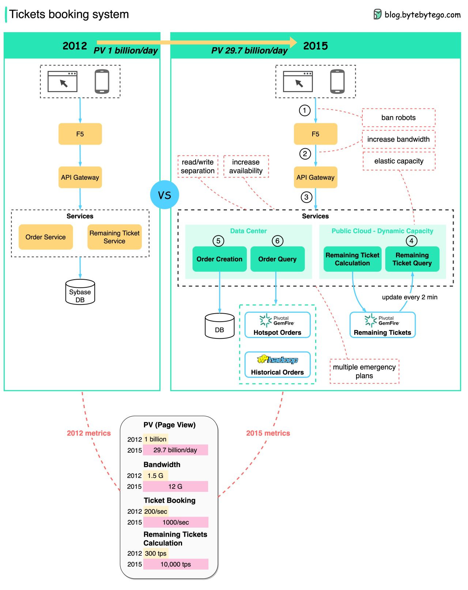

refer to https://blog.bytebytego.com/i/86976622/online-ticketing-platform

# Online Ticketing Platform

Ticketmaster halted public ticket sales of Taylor Swift’s tour due to extraordinarily high demands on ticketing systems.

The diagram below shows the evolution of the online China Train ticket booking system.

The China Train tickets booking system has similar challenges as the Ticketmaster system:
1. Very **high concurrent visits** during peak hours.
2. The QPS for checking remaining tickets and orders is very high
3. A lot of **bots**

The solutions
1. Separate read and write requests. Because anxious users kept refreshing the web page to check if there were tickets available, the system could under huge pressure. 
To handle the calculation and query in memory, the remaining ticket components were **moved entirely to GemFire**. It is possible to fit the entire country's train tickets into several Gigabytes of memory. 
In addition, the order query component was moved to GemFire to reduce the load on the order database. Hadoop was used to store historical orders.
2. Leverage public cloud for elastic capacity.
3. **Ban bots. It reduced the traffic by 95%.**
4. Increase the bandwidth of the system.
5. Increase system availability by setting up more data centers in different cities.
6. Design multiple emergency plans.

Note: the numbers are based on the back-of-the-envelope estimation (not official data). 

*Pivotal Gemfire*
- in-memory data management
- https://gemfire.docs.pivotal.io/98/gemfire/getting_started/gemfire_overview.html
