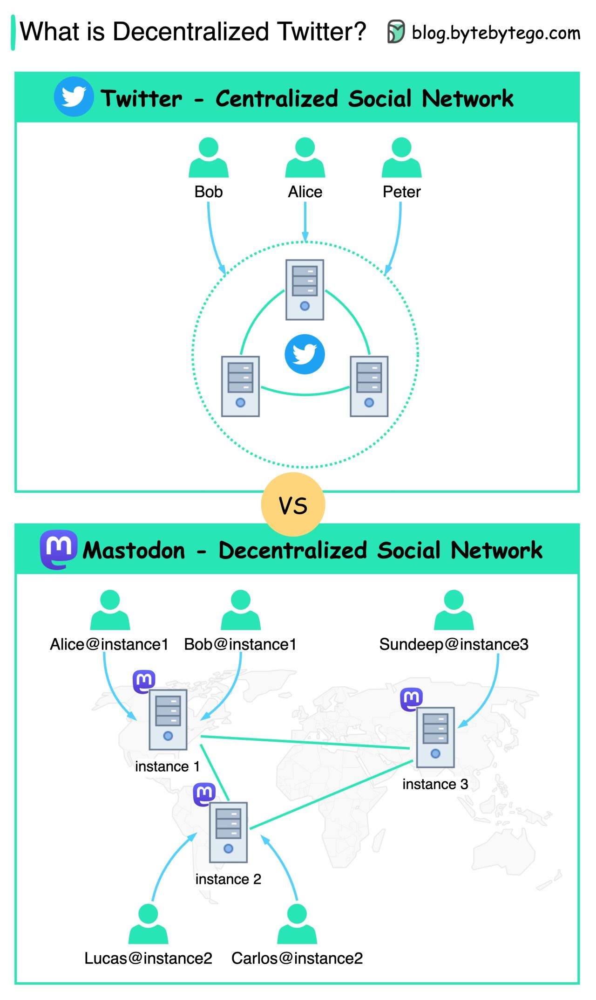

refer to https://blog.bytebytego.com/i/86976622/do-we-have-an-alternative-for-twitter-services

# Do we have an alternative for Twitter services?

What is a decentralized social network service?

The diagram below shows a comparison between Twitter and Mastodon.

It is said that **Trump's new social media platform Truth Social was using the Mastodon**.

Mastodon runs self-hosted social network services. It is free and has no ads. Its MAU (Monthly Active Users) increased from 500k in Oct to 1 million in Nov, after Elon Musk’s takeover of Twitter.

Unlike Twitter, whose servers belong to the Twitter company, **Mastodon’s servers do not belong to any company. Its network is composed of servers (instances) from different organizations.**

When users register, they must choose a server to start with. Since the servers sync up with each other, users can still receive updates from other servers.

**Because the network is run by volunteers, the company has only one employee** - its founder Eugen Rochko. It is run by crowdfunding and is now supported by 3500 people.

*mastodon*
- https://joinmastodon.org/
- https://github.com/mastodon/mastodon
- https://www.youtube.com/watch?v=IPSbNdBmWKE
- Ruby on Rails, React.js, Node.js, PostgreSQL, Redis
