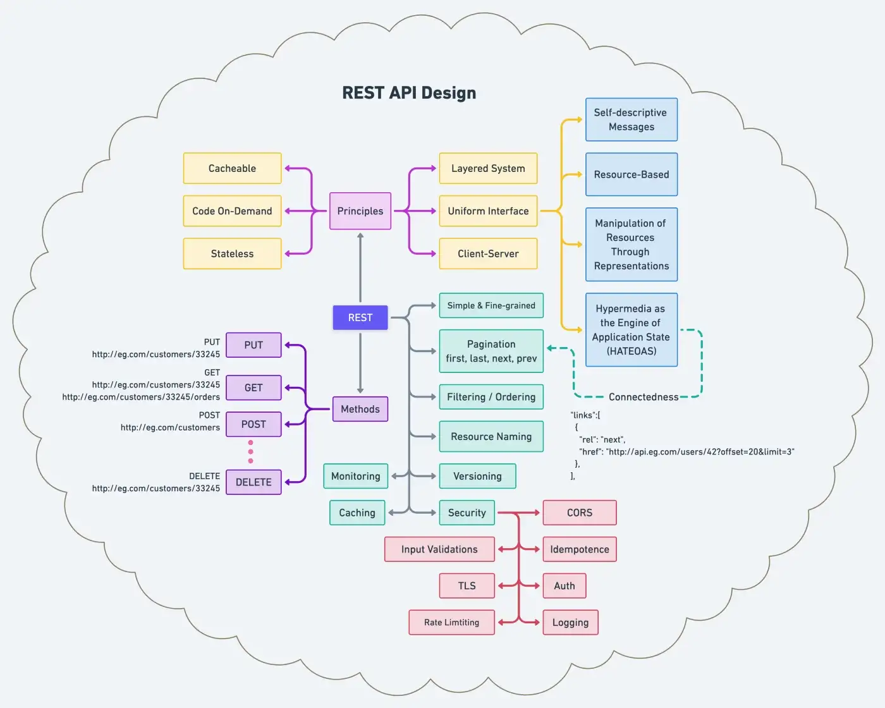
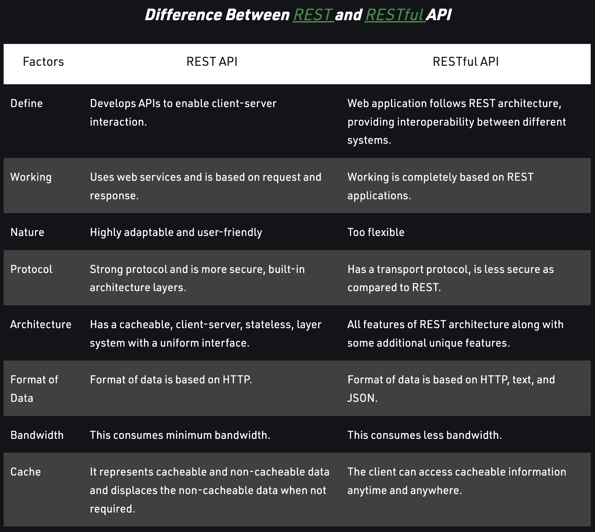

refer to https://blog.devgenius.io/best-practice-and-cheat-sheet-for-rest-api-design-6a6e12dfa89f

# Principles & Best practices of REST API Design

Here is the complete diagram to easily understand REST API’s principles, methods, and best practices.

## The Six Principles / Constraints
### Client-Server 
Separation of concerns is the principle behind the client-server constraints. By separating the user interface concerns from the data storage concerns, we improve the portability of the user interface across multiple platforms and improve scalability by simplifying the server components.

### Stateless
communication must be stateless, as in the client-stateless-server (CSS) style. Each request from the client to the server must contain all of the information necessary to understand the request. Session state is therefore kept entirely on the client.

### Cacheable
To improve network efficiency, we add cache constraints to form the client-cache-stateless-server style. Cache constraints require that the data respond to a request with the implicit or explicit label as cacheable or non-cacheable. If a response is cacheable, then a client cache is given the right to reuse that response data for later, equivalent requests.

### Layered System
A client cannot ordinarily tell whether it is connected directly to the end server or an intermediary along the way. Intermediary servers may improve system scalability by enabling load-balancing and by providing shared caches. Layers may also enforce security policies.

### Code-on-Demand
REST allows client functionality to extend by downloading and executing code in the form of applets or scripts. Simplifies clients by reducing the number of features required to be pre-implemented. It allows features to download after deployment improves system extensibility.

### Uniform Interface
By applying the software engineering principle of generality to the component interface, the overall system architecture becomes simplified, and the visibility of interactions is improved. Implementations decouple from the services they provide, which encourages independent evolvability. REST defines by four interface constraints: identification of resources, manipulation of resources through representations, self-descriptive messages, and Hypermedia as the engine of application state.

### Self-descriptive Messages
Each message includes enough information to describe how to process the message.

### Resource-Based
Individual resources are identified in requests using URIs as resource identifiers. The resources themselves are conceptually separate from the representations that return to the client.
Manipulation of Resources Through Representations: When a client represents a resource, including any metadata attached, it has enough information to modify or delete the resource on the server, provided it has permission to do so.
Hypermedia as the Engine of Application State (HATEOAS): Clients deliver state via body contents, query-string parameters, request headers, and the requested URI (the resource name). Services provide the state to clients via body content, response codes, and response headers.

## Best Practices

Now, Let’s change the gear to understand REST’s essential best practice, which every engineer should know.

### Keep it Simple and Fine-Grained
Create APIs that mimic your system’s underlying application domain or database architecture of your system. Eventually, you’ll want aggregate services — services that utilize multiple underlying resources to reduce chattiness.
Filtering & Ordering: For large data sets, limiting the amount of data returned is vital from a bandwidth standpoint. Additionally, we may want to specify the fields or properties of a resource to be included in the response, thereby limiting the amount of data that comes back. We eventually want to query for specific values and sort the returned data.

### Versioning
There are many ways to break a contract and negatively impact your clients in API development. If you are uncertain of the consequences of your change, it is better to play it safe and consider Versioning. There are several factors to consider when deciding if a new version is appropriate or if a modification of an existing representation is sufficient and acceptable. Since maintaining many versions becomes cumbersome, complex, error-prone, and costly, you should support no more than two versions for any given resource.

### Cache
Caching enhances scalability by enabling layers in the system to eliminate remote calls to retrieve requested data. Services improve cache-ability by setting headers on responses such as Cache-Control, Expires, Pragma, Last-Modified, etc

### Pagination
One of the principles of REST is connectedness — via hypermedia links. At the same time, services are still helpful without them. APIs become more self-descriptive when links return in the response. For collections returned in a response that supports Pagination, ‘first’, ‘last’, ‘next’, and ‘prev’ links at a minimum are beneficial.

### Resource-Naming
An API is intuitive and easy to use when resources are named well. Done poorly, that same API can feel klutzy and be challenging to use and understand. RESTful APIs are for consumers. The name and structure of URIs should convey meaning to those consumers. It’s often difficult to know what the data boundaries should be, but with the understanding of your data, you most likely are equipped to take a stab and what makes sense to return as a representation to your clients. Design for your clients, not for your data.
#### Pluralization
The commonly-accepted practice is always to use plurals in node names to keep your API URIs consistent across all HTTP methods. The reasoning is that `customers` are a collection within the service suite and the ID (e.g., 33245) refers to one of those customers in the collection.

###  Monitoring
Make sure to add all kinds of monitoring to improve the quality or performance of your API. Data points can be Response Time (P50, p90, P99), Status Codes (5XX, 4XX, etc.), Network Bandwidth, and many more.

###  Security:
#### Authorization / Authentication
Authorization for services is no different than authorization for any application. Ask this question, “Does this principal have the requested permission on the given resource?”
#### CORS
Implementing CORS on a server is as simple as sending an additional HTTP header in the response, such as Access-Control-Allow-Origin, Access-Control-Allow-Credentials, etc
#### TLS
All authentication should use SSL. OAuth2 requires the authorization server and access token credentials to use TLS.
#### Idempotence
an operation that will produce the same results if executed once or multiple times. It may have a different meaning depending on the context in which it applies. In the case of methods or subroutine calls with side effects, for instance, it means that the modified state remains the same after the first call.
#### Input Validation
Validate all input on the server. Accept “known” good input and reject bad input, Protect against SQL and NoSQL injection, Restrict the message size to the exact length of the field, Services should only display generic error messages, and many more.
#### Rate limiting
is a strategy for limiting network traffic. It puts a cap on how often someone can repeat an action within a certain timeframe — for instance, trying to log in to an account.
#### Logging
Make sure you do not accidentally log any Personally identifiable information (PII).

# *REST API vs RESTFUL API*
refer to https://www.geeksforgeeks.org/know-the-difference-between-rest-api-and-restful-api/

