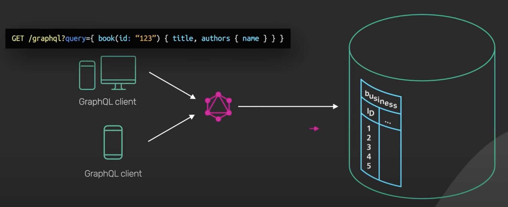

refer to https://blog.bytebytego.com/i/84137023/what-is-graphql-rest-vs-graphql

refer to https://www.altexsoft.com/blog/engineering/graphql-core-features-architecture-pros-and-cons/

# What Is GraphQL? REST vs. GraphQL

GraphQL is a query language for API developed by Meta. It provides a schema of the data in the API and gives clients the power to ask for exactly what they need.

# What's Different?

# Request and Response

# GraphQL creates query from Client-side, but REST has fixed query on server 

# N+1 Query for one result (Rest needs multiple requests, but GraphQL is sample)

# Rest needs only a simple request, but GraphQL needs heavy tools which take costs on both client and server

# Rest has good cache system, but GraphQL is hard to cache

# GraphQL may allows clients to scan unexpected table

