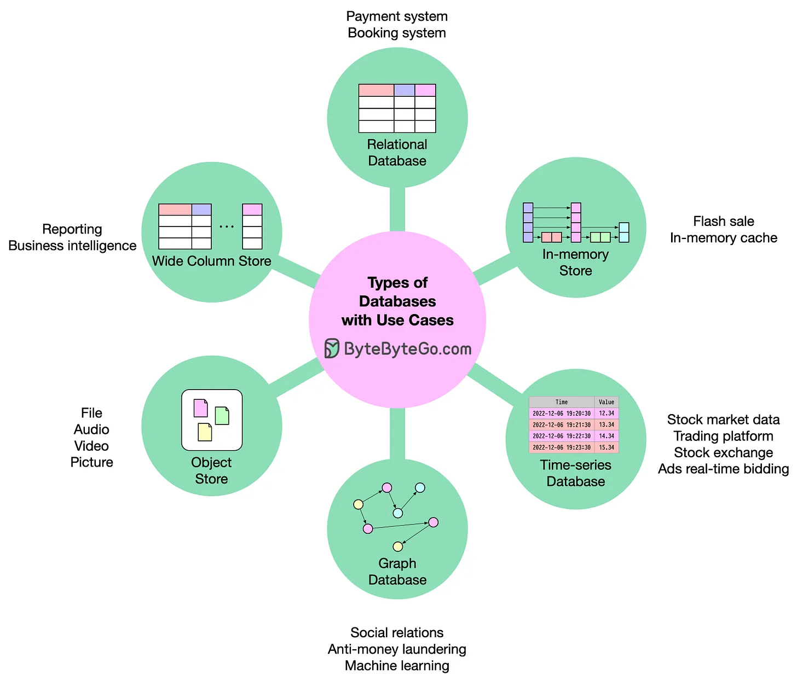

refer to https://blog.bytebytego.com/i/89821739/how-do-you-decide-which-type-of-database-to-use

# How do you decide which type of database to use?

There are hundreds or even thousands of databases available today, such as Oracle, MySQL, MariaDB, SQLite, PostgreSQL, Redis, ClickHouse, MongoDB, S3, Ceph, etc. How do you select the architecture for your system? My short summary is as follows:

- Relational database. Almost anything could be solved by them.
  - Oracle, MySQL, PostgreSQL
- In-memory store. Their speed and limited data size make them ideal for fast operations.
  - Redis, Amazon ElastiCache
  - https://www.trustradius.com/in-memory-databases
- Time-series database. Store and manage time-stamped data.
  - Prometheus, Aerospike
  - https://www.g2.com/categories/time-series-databases
- Graph database. It is suitable for complex relationships between unstructured objects.
  - Amazon Neptune
  - https://solutionsreview.com/data-management/the-best-graph-databases/
- Document store. They are good for large immutable data.
  - MongoDB, Amazon DynamoDB
  - https://db-engines.com/en/ranking/document+store
- Wide column store. They are usually used for big data, analytics, reporting, etc., which needs denormalized data.
  - Apache Cassandra, Bigtable
  - https://en.wikipedia.org/wiki/Wide-column_store

