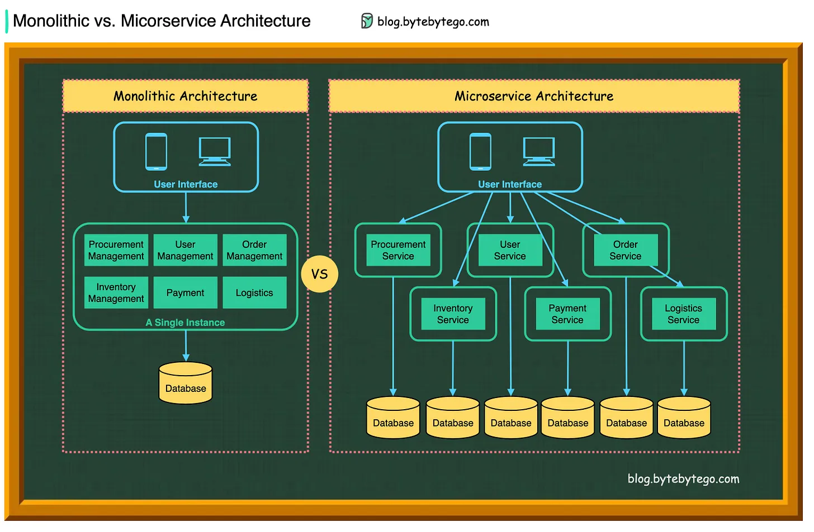

refer to https://blog.bytebytego.com/i/88429916/what-are-the-differences-between-monolithic-and-microservice-architecture

# What are the differences between monolithic and microservice architecture?

The diagram compares monolithic and microservice architecture in the ideal world.

Suppose we have an eCommerce website that needs to handle the functions below:
- User Management 
- Procurement Management 
- Order Management 
- Inventory Management 
- Payments 
- Logistics

In a **monolithic architecture**, all the components are deployed in one **single instance**. 
The service **calls are within the same process, and no RPCs**. 
The data tables relating to each component are usually deployed in the same database.

In a **microservice architecture**, each component becomes a self-contained service, **maintained by a specialized team**. 
The **boundaries** between services are **clearly defined**. 
The user interface talks to multiple services to get a workflow done. 
This is **suitable for scaling out** the business when the business has substantial growth.

However, since there are many more instances to maintain, microservice architecture needs quite some investment in DevOps.

At one point, microservice architecture was the golden standard as almost every large tech company moved from monolithic to microservices. 
But now, companies started to rethink the pros and cons of microservices. 
Some of the most controversial definitions of microservices are the exclusive use of a database & making 1000+ RPCs within a single client request. 

