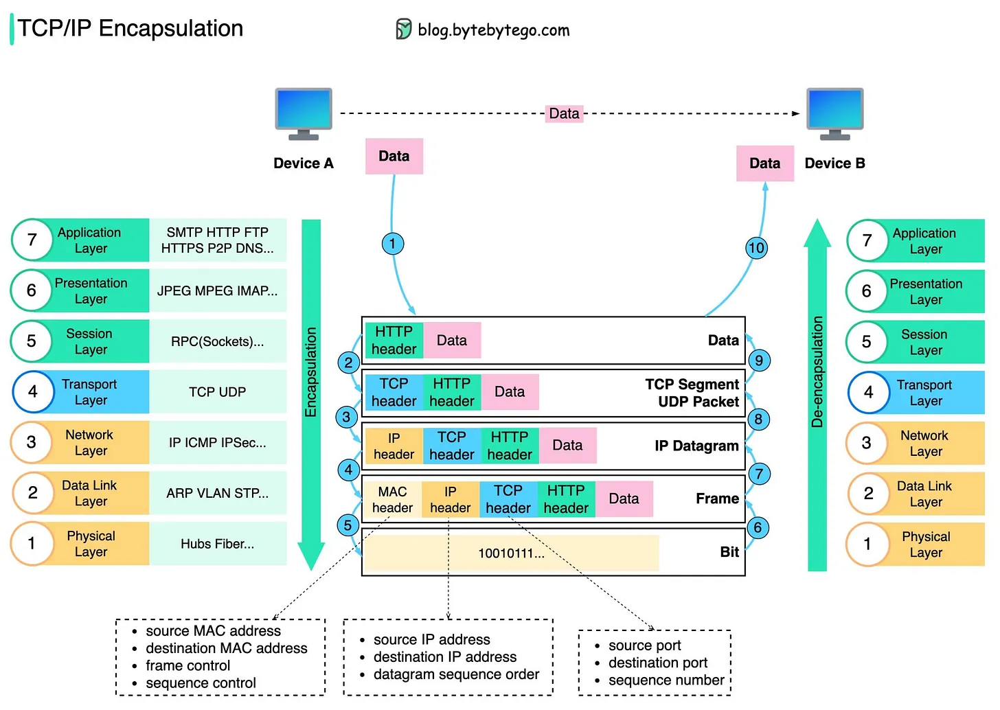

refer to https://blog.bytebytego.com/i/85578651/how-is-data-sent-over-the-network-why-do-we-need-so-many-layers-in-the-osi-model

# How is data sent over the network? Why do we need so many layers in the OSI model?

The diagram below shows how data is encapsulated and de-encapsulated when transmitting over the network.

Step 1: 
When Device A sends data to Device B over the network via the HTTP protocol, 
it is first added an HTTP header at the application layer.

Step 2: 
Then a TCP or a UDP header is added to the data. 
It is encapsulated into TCP segments at the transport layer. 
The header contains the source port, destination port, and sequence number.

Step 3: 
The segments are then encapsulated with an IP header at the network layer. 
The IP header contains the source/destination IP addresses.

Step 4: 
The IP datagram is added a MAC header at the data link layer, 
with source/destination MAC addresses.

Step 5: 
The encapsulated frames are sent to the physical layer and sent over the network in binary bits.

Steps 6-10: When Device B receives the bits from the network, 
it performs the de-encapsulation process, 
which is a reverse processing of the encapsulation process. 
The headers are removed layer by layer, and eventually, Device B can read the data.

We need layers in the network model because each layer focuses on its own responsibilities. 
Each layer can rely on the headers for processing instructions 
and does not need to know the meaning of the data from the last layer.

