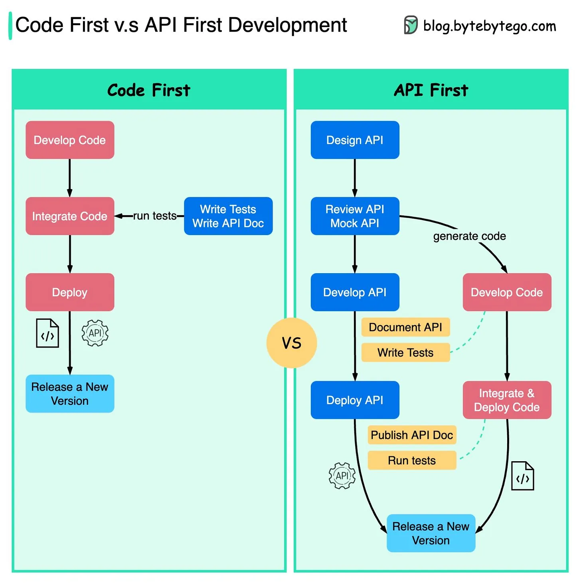

refer to https://blog.bytebytego.com/i/85578651/code-first-vs-api-first-a-change-of-software-development-philosophy

# Code First v.s. API First - A change of software development philosophy

The diagram below shows the differences between code-first development and API-first development. Why do we want to consider API first design?

## Microservices increase system complexity.
We have separate services to serve different functions of the system. 
While this kind of architecture facilitates decoupling and segregation of duty, 
we **need to handle the various communications among services**.
It is better to think through the system's complexity before writing the code 
and carefully defining the boundaries of the services.

## Separate functional teams need to speak the same language.
The dedicated functional teams are only **responsible for their own components and services**. 
It is recommended that the organization speak the same language via API design.
We can **mock requests and responses** to validate the API design **before writing code**.

## Improve software quality and developer productivity
Since we have **ironed out most of the uncertainties when the project starts**, 
the overall development process is smoother, and the software quality is greatly improved.
Developers are happy about the process as well 
because they can focus on functional development instead of negotiating sudden changes.
The possibility of having surprises toward the end of the project lifecycle is reduced.

Because we have designed the API first, 
the tests can be designed while the code is being developed. 
**In a way, we also have TDD (Test Driven Design) when using API first development**.

