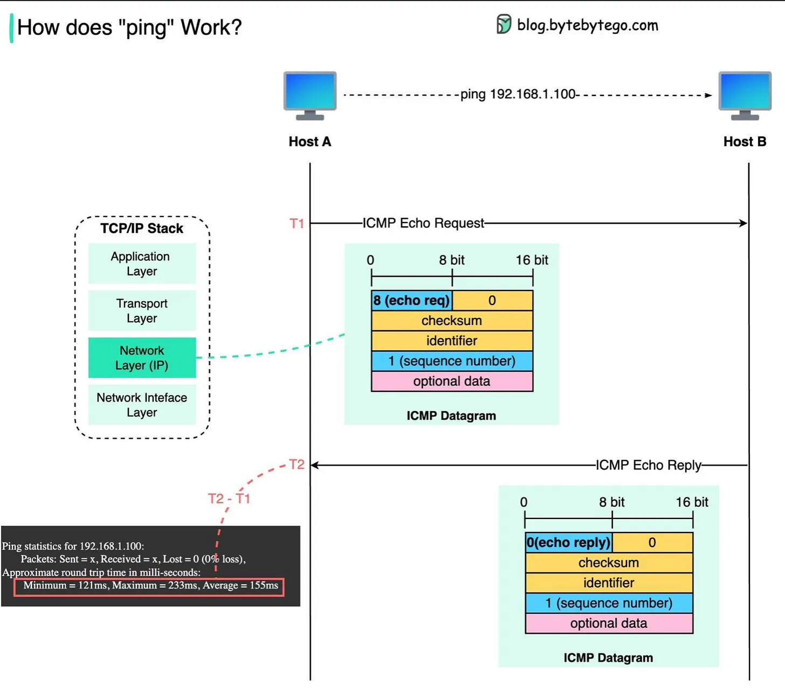

refer to https://blog.bytebytego.com/i/85578651/what-happens-when-we-ping-a-server
refer to https://www.firewall.cx/networking-topics/protocols/icmp-protocol/152-icmp-echo-ping.html#:~:text=ICMP%20Echos%20are%20used%20mostly,get%20to%20the%20other%20side.

# Code First v.s. API First - A change of software development philosophy

The The diagram below shows how the “ping” command works.

The “ping” command runs on ICMP (Internet Control Message Protocol), which is a network layer protocol.

There are 6 common types of messages in ICMP. For the ping command, we mainly use “echo request” and “echo reply”.

Host A sends an ICMP echo request (type = 8) with a sequence number 1. The request is encapsulated with an IP header to specify the source and destination IP addresses.

When host B receives the data, it sends back an ICMP echo reply (type = 0) with sequence number 1 to host A.

When host A receives the echo reply, it correlates the request and reply with the sequence number, and uses T1 and T2 to calculate the round trip time. That’s how we see the ping statistics.

ICMP Echos are used mostly for troubleshooting. When there are 2 hosts which have communication problems, a few simple ICMP Echo requests will show if the 2 hosts have their TCP/IP stacks configured correctly and if there are any problems with the routes packets are taking in order to get to the other side.

